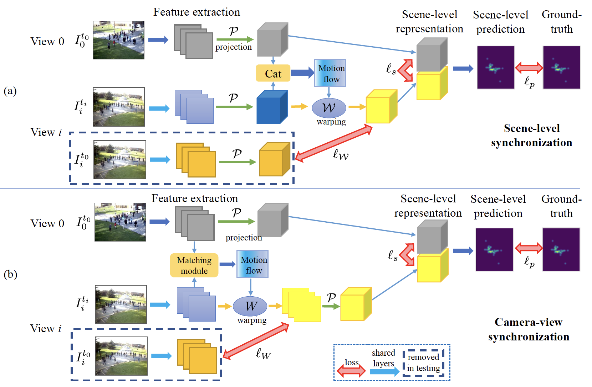

## [Single-Frame-Based Deep View Synchronization for Unsynchronized Multicamera Surveillance, IEEE TNNLS 2023](https://ieeexplore.ieee.org/document/9775149)

Compared to single cameras, multi-camera networks allow better understanding and modeling of the 3D world through more densely sampling of information in a 3D scene. Multi-camera based vision tasks have been a popular research field, especially deep learning related tasks, such as 3D pose estimation from multiple 2D observations, 3D reconstruction, multi-view tracking, and multi-view crowd counting. For these multi-view tasks, it is usually assumed that the multi-cameras are temporally synchronized when designing DNNs models, i.e., all cameras capture images at the same time point. However, the synchronization assumption for multi-camera systems may not always be valid in practical applications due to a variety of reasons, such as dropped camera frames due to limited network bandwidth or system resources, network transmission delays, etc.  Thus, handling unsynchronized multi-cameras is an important issue in the adoption and practical usage of multiview computer vision.

In this paper, we consider the regime of low-fps multiview camera systems – we only assume that a single relevant image is captured from each camera, and thus the input is a set of unsynchronized multi-camera images. We propose a synchronization model that operates in conjunction with existing DNN-based multi-view models to allow them to work on unsynchronized data. Our proposed model first synchronizes other views to a reference view using a differentiable module, and then the synchronized multi-views features are fused and decoded to obtain the task-oriented output. We consider two variants of our model that perform synchronization at different stages in the pipeline: 1) scene-level synchronization performs the synchronization after projecting the camera features to their 3D scene representation; 2) camera-level synchronization performs the synchronization between camera views first, and then projects the synchronized 2D feature maps to their 3D representations. In both cases, motion flow between the cameras’ feature maps are estimated and then used to warp the feature maps to align with the reference view (either at the scene-level or the camera-level). With both variants, the view synchronization and the multi-view fusion are unified in the same framework and trained in an end-to-end fashion. In this way, the original DNN-based multi-view model can be adapted to work in the unsynchronized setting by adding the view synchronization module, thus avoiding the need to design a new model. Furthermore, the synchronization module only relies on content-based image matching and camera geometry, and thus is widely applicable to many DNNs-based multi-view tasks, such as crowd counting, tracking, 3D pose estimation, and 3D reconstruction.

### Code implementation:

The implementation is based on Keras 2.2.4 and Tensorflow 1.11.0. No commercial use is allowed.

### Dataset Download:
The dataset is about 15 GB. You can download it here:

- [One Drive](https://portland-my.sharepoint.com/:f:/g/personal/qzhang364-c_my_cityu_edu_hk/Esopqz6dt-hHuku3Zoy14x0BrqhLizm5Xp-kX_09M4GZdg?e=ZlUfC4)
   

### Cite paper:
If you use the code or the dataset, or think the paper is useful, please cite our paper:

    @article{zhang2022single,
      author={Zhang, Qi and Chan, Antoni B.},
      journal={IEEE Transactions on Neural Networks and Learning Systems}, 
      title={Single-Frame-Based Deep View Synchronization for Unsynchronized Multicamera Surveillance}, 
      year={2023},
      volume={34},
      number={12},
      pages={10653-10667},
      doi={10.1109/TNNLS.2022.3170642}
   }
